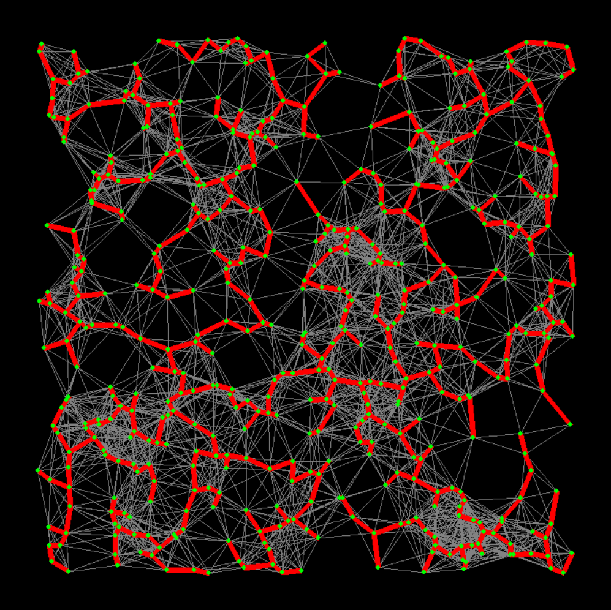

# Minimum-Spanning-Tree

  
   

  
   

## Description (source: https://en.wikipedia.org/wiki/Prim%27s_algorithm)
 Prim's algorithm is a greedy algorithm that finds a minimum spanning tree for a weighted undirected graph. This means it finds a 
 subset of the edges that forms a tree that includes every vertex, where the total weight of all the edges in the tree is minimized.
 The algorithm operates by building this tree one vertex at a time, from an arbitrary starting vertex, at each step adding the
 cheapest possible connection from the tree to another vertex.
 
 ## Algorithmic approach
1. Initialize a tree with a single vertex, chosen arbitrarily from the graph.
2. Grow the tree by one edge: of the edges that connect the tree to vertices not yet in the tree, find the minimum-weight edge,
and transfer it to the tree.
3. Repeat step 2 (until all vertices are in the tree).

## Pseudo-Code
1. Associate with each vertex v of the graph a number C[v] (the cheapest cost of a connection to v) and an edge E[v] (the edge providing that cheapest connection). To initialize these values, set all values of C[v] to +∞ (or to any number larger than the maximum edge weight) and set each E[v] to a special flag value indicating that there is no edge connecting v to earlier vertices.\
2. Initialize an empty forest F and a set Q of vertices that have not yet been included in F (initially, all vertices).\
3. Repeat the following steps until Q is empty:\
  a. Find and remove a vertex v from Q having the minimum possible value of C[v]\
  b. Add v to F and, if E[v] is not the special flag value, also add E[v] to F\
  c. Loop over the edges vw connecting v to other vertices w. For each such edge, if w still belongs to Q
  and vw has smaller weight than C[w], perform the following steps:\
    i. Set C[w] to the cost of edge vw\
    ii. Set E[w] to point to edge vw.\
Return F
